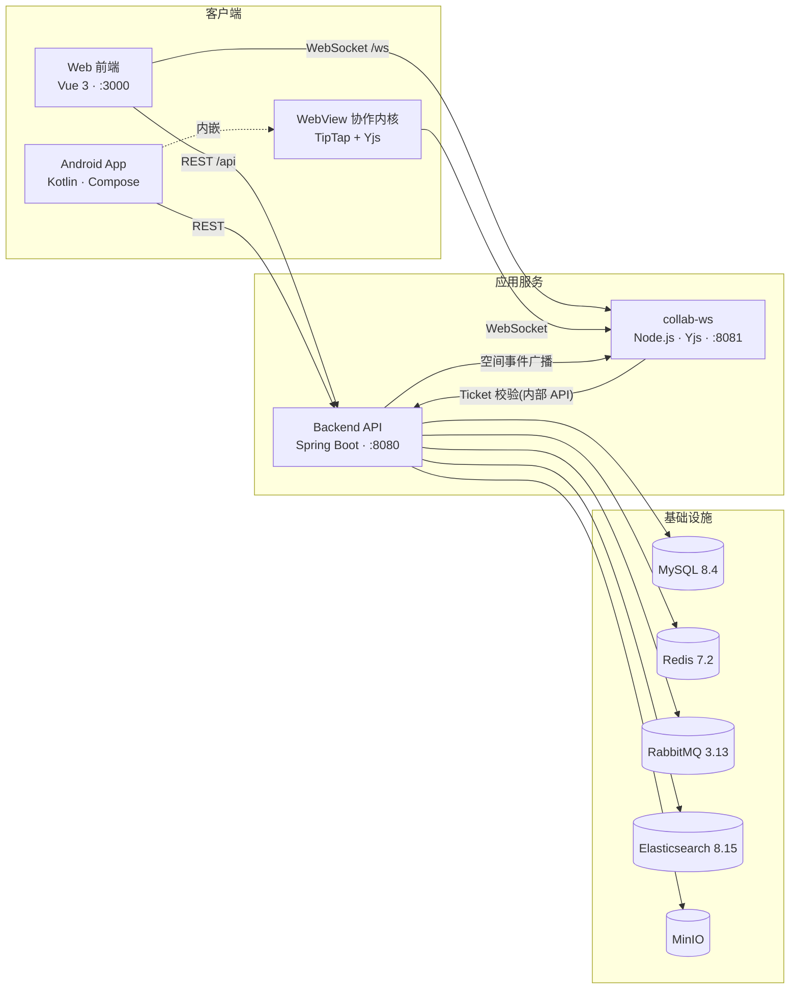

# Notask Flow

> 个人知识管理与团队任务协作平台

[English](README_EN.md) | 中文


## 简介

Notask Flow 是一个集**个人知识管理**与**团队任务协作**于一体的多端平台:个人空间提供笔记、任务、待办、文件与专注统计;团队空间提供项目、任务看板、协作文档、成员管理与团队报表;文档基于 Yjs 实现多端实时协同编辑。它解决的核心痛点是:个人笔记与团队任务分散在多个工具中,知识无法在同一个空间内与任务、文件、协作打通。

## 项目演示

**Web 端**(完整截图见 [frontend/img/](frontend/img/)):

| 登录 | 注册 |
|:---:|:---:|
|  |  |
| **个人空间 · 笔记** | **个人空间 · 任务** |
|  |  |
| **个人空间 · 统计** | **团队空间 · 任务看板** |
|  |  |
| **团队空间 · 文档协作** | **团队空间 · 项目详情** |
|  |  |
| **团队空间 · 报表** | **团队空间 · 成员管理** |
|  |  |

**Android 端**(完整截图见 [android/img/](android/img/)):

| 首页 | 笔记编辑 |
|:---:|:---:|
|  |  |

## 核心特性

- **个人空间**:笔记编辑、任务管理、待办追踪、文件管理、专注统计
- **团队空间**:项目管理、任务看板、协作文档、成员管理、团队报表
- **实时协作**:基于 Yjs 的多人文档协同编辑(Web 与 Android 共用同一套协同协议)
- **多端支持**:Web 前端 + Android 原生客户端
- **管理后台**:用户、会话、存储、系统通知等平台级管理能力

## 系统架构



数据流要点:

- 所有业务 REST 请求(`Bearer JWT`)指向 Backend;文档协同的 WebSocket 直连 collab-ws。
- collab-ws 通过后端**一次性 Ticket + 内部 API** 鉴权协作者;后端在事务提交后把空间实时事件反向推送给 collab-ws 广播。
- Backend 依赖五个基础设施组件:MySQL(业务数据)、Redis(会话/JWT)、RabbitMQ(异步事件)、Elasticsearch(笔记与文件搜索)、MinIO(对象存储)。

## 技术栈

| 组件 | 技术 |
|------|------|
| 后端 | Java 21, Spring Boot 3.2.12, MyBatis-Plus 3.5.7, Sa-Token 1.39.0 |
| 前端 | Vue 3.4, TypeScript 5.5, Vite 5.4, Element Plus 2.8, TipTap 3.22 |
| Android | Kotlin 2.3.21, Jetpack Compose, Hilt, Retrofit, Room |
| 协同服务 | Node.js 20, y-websocket, Yjs 13.6 |
| 数据库 | MySQL 8.4, Redis 7.2 |
| 消息队列 | RabbitMQ 3.13 |
| 搜索 | Elasticsearch 8.15.5 |
| 存储 | MinIO |

## 模块导航

| 模块 | 目录 | 主要职责 | 详细文档 |
|------|------|----------|----------|
| 后端服务 | [`backend/`](backend/) | RESTful API、空间级 RBAC 鉴权、业务逻辑、文件与搜索 | [中文](backend/README.md) · [English](backend/README_EN.md) |
| Web 前端 | [`frontend/`](frontend/) | 用户界面与管理后台(Admin),并为 Android 构建协作编辑内核 | [中文](frontend/README.md) · [English](frontend/README_EN.md) |
| Android 客户端 | [`android/`](android/) | 移动端 App,内嵌 WebView 协作编辑内核 | [中文](android/README.md) · [English](android/README_EN.md) |
| 部署与协同 | [`deploy/`](deploy/) | Docker Compose 编排、Nginx、Yjs 协同 WebSocket 服务 | [中文](deploy/README.md) · [English](deploy/README_EN.md) |

> 模块间唯一的构建依赖:前端执行 `npm run build:android-collab` 会将协作编辑器内核输出到 `android/app/src/main/assets/notask_collab/`,修改编辑内核后需重新构建并同步到 Android 工程。

## 环境依赖

- **Docker 部署**:Docker Engine 24+ 与 Docker Compose v2,无需其他环境
- **本地开发**(按需):
  - 后端:JDK 21、Maven 3.9+
  - 前端:Node.js ≥ 18(推荐 20+)
  - Android:Android Studio、JDK 21、Android SDK 35

各模块更细的版本要求见其 README。

## 快速开始

### Docker 一键部署(推荐)

```bash
git clone git@github.com:AtaraxyEcho/notask-flow.git
cd notask-flow
cp deploy/prod/.env.example deploy/prod/.env
# 编辑 deploy/prod/.env,修改所有密码和密钥(清单见 deploy/README.md)
cd deploy/prod
docker compose --profile app up -d
```

启动后访问 `http://localhost:3000`,后端 API 文档在 `http://localhost:8080/swagger-ui/index.html`。

### 本地开发

```bash
# 1. 启动基础设施(MySQL/Redis/RabbitMQ/ES/MinIO/collab-ws,首次启动自动建库建表)
cd deploy/dev && cp .env.example .env && docker compose up -d
cd ../..

# 2. 启动后端(新开一个终端;可选:复制 backend/.env.example 为 backend/.env 调整本地连接)
cd backend && mvn spring-boot:run
```

```bash
# 3. 启动前端(再开一个终端)
cd frontend && cp .env.example .env && npm install && npm run dev
```

访问 `http://localhost:3000`。开发环境管理员账号默认 `Administrator / change-me`(见 `deploy/dev/.env.example`)。

Android 端开发见 [android/README.md](android/README.md#快速开始)。

## 如何配置

本仓库**没有根目录全局 `.env`**,所有环境变量模板按模块就近放置,使用时复制对应 `.example` 文件并按需修改(变量含义见各自 README,不在 README 中罗列具体值):

| 模块 | 模板文件 | 用途 |
|------|----------|------|
| 部署 | `deploy/dev/.env.example`、`deploy/prod/.env.example` | 容器端口、数据库/中间件凭据、JWT、协作服务令牌 |
| 后端 | `backend/.env.example` | dev profile 本地连接(MySQL/Redis/RabbitMQ/ES/MinIO/JWT) |
| 前端 | `frontend/.env.example` | API 与 WebSocket 基础路径、开发代理目标 |
| Android | `android/gradle.properties.example`、`android/local.properties.example` | SDK 路径、API/WebSocket 地址 |

## 贡献指南

- 提交代码前请阅读 [AGENTS.md](AGENTS.md) 中的 Java / Kotlin 代码规范,所有源文件使用 UTF-8 编码。
- 功能分支开发,向 `main` 发起 Pull Request;PR 描述请说明改动动机与验证方式。
- Bug 反馈与功能建议请提 Issue,并附上复现步骤与相关日志。

## 许可证

本项目使用 [GNU Affero General Public License v3.0](LICENSE) 许可证。

---

Last Updated: 2026-09-06
