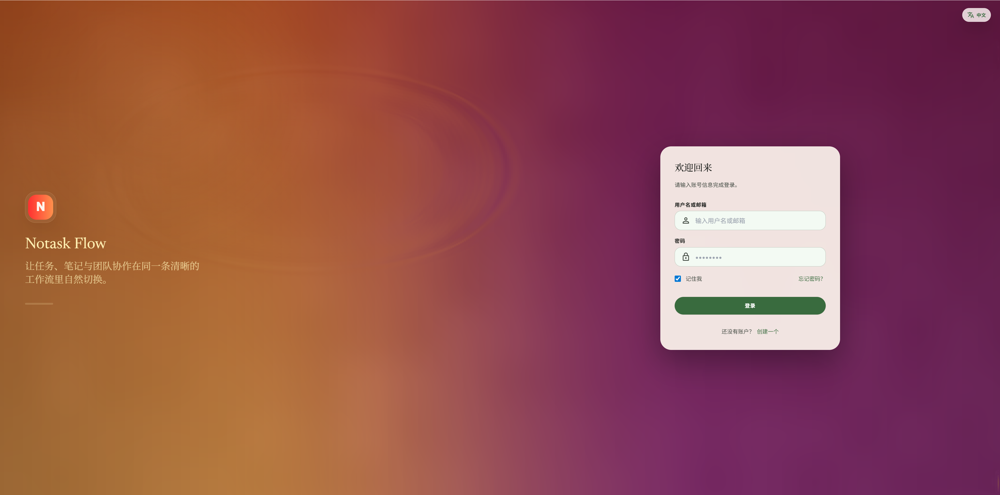
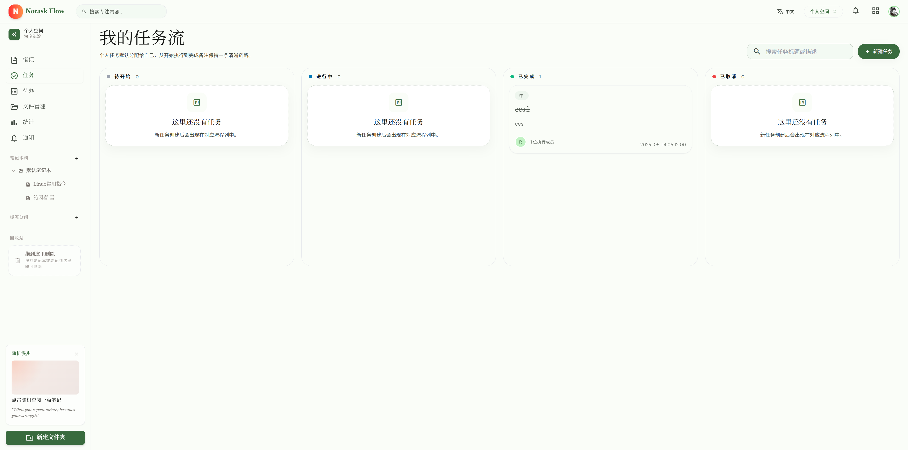
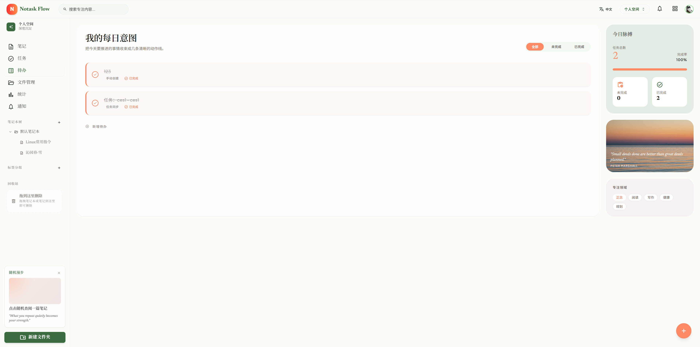
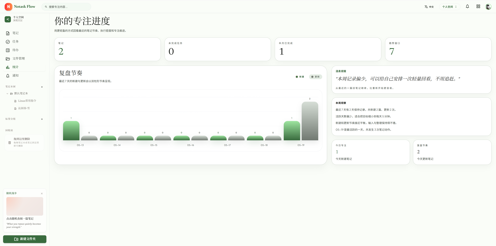
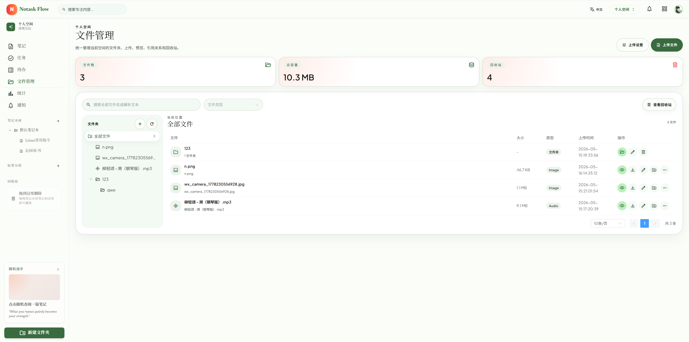
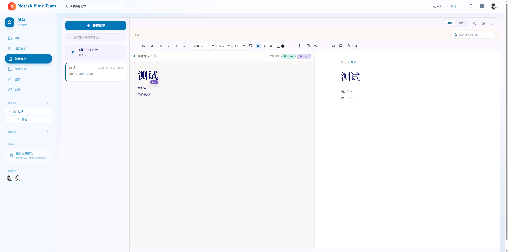
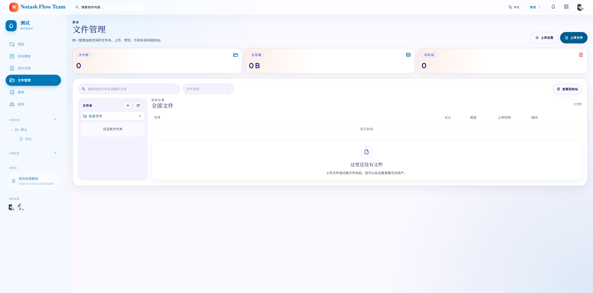
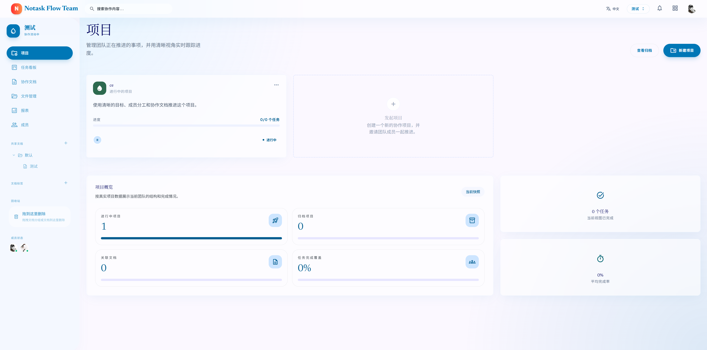
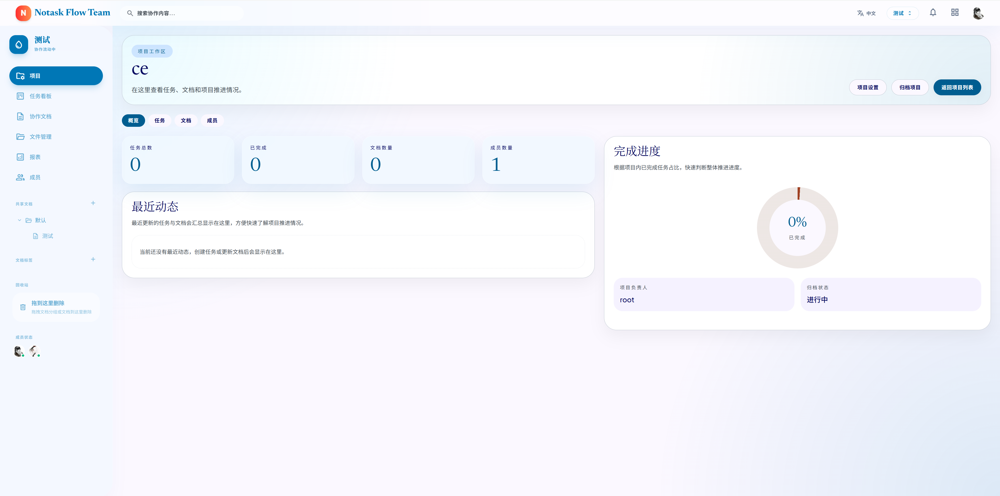

# Notask Flow Frontend

Notask Flow Web 前端，基于 Vue 3、TypeScript 和 Vite 构建，提供个人空间与团队空间下的笔记、任务、待办、文件、项目、统计、通知和协作文档体验。

## 项目描述

Notask Flow 是一个面向个人专注管理与团队协作执行的 Web 工作台。它把笔记、任务、待办、文件、项目、统计报表、成员管理和协作文档放在同一套空间模型中，让用户可以在“个人空间”中沉淀自己的日常记录与行动计划，也可以在“团队空间”中围绕项目、成员、任务看板和共享文档完成协作。

前端体验采用轻量、柔和、低干扰的工作台风格：个人空间以浅绿色与暖色为主，强调安静记录、个人节奏和专注感；团队空间以蓝色与淡紫背景为主，强调协作状态、任务流转和团队信号。整体页面以固定顶部栏、左侧空间导航、右侧内容工作区构成，支持在笔记编辑、任务看板、待办追踪、文件管理、团队报表和文档协作之间快速切换。

核心能力包括：

- **个人空间**：笔记编辑与预览、个人任务流、每日待办、文件管理、专注统计和通知。
- **团队空间**：项目管理、项目详情、团队任务看板、协作文档、团队文件、成员管理和团队报表。
- **实时协作**：基于 Yjs 的文档协同编辑，以及空间内任务、通知、成员状态等实时事件同步。
- **文件与预览**：支持文件上传、分片上传、文件夹管理、文件预览、回收站和内容引用关系。
- **工程化能力**：统一 API 层、Pinia 状态持久化、路由守卫、Vite 代理、构建分包和环境变量模板。

## 技术栈

| 类型 | 技术 |
|------|------|
| 框架 | Vue 3 |
| 语言 | TypeScript |
| 构建 | Vite 5 |
| 路由 | Vue Router 4 |
| 状态管理 | Pinia、pinia-plugin-persistedstate |
| UI | Element Plus、Tailwind CSS |
| 请求 | Axios |
| 富文本/协同 | TipTap、Yjs、y-protocols、y-prosemirror |
| 图表 | ECharts、vue-echarts |
| 文件预览 | `@vue-office/docx`、`@vue-office/excel`、`@vue-office/pdf` |
| 安全处理 | DOMPurify |

## 项目结构

```text
frontend/
├── src/
│   ├── api/            # Axios 封装与业务 API 模块
│   ├── collab/         # Yjs 协同编辑和空间实时事件 WebSocket Provider
│   ├── components/     # 通用、个人空间、团队空间、笔记、文件、项目组件
│   ├── composables/    # 主题、权限、空间实时事件等组合逻辑
│   ├── i18n/           # 中英文语言包
│   ├── layouts/        # 登录布局与应用主布局
│   ├── router/         # 路由、鉴权守卫、团队空间守卫
│   ├── stores/         # Pinia 用户、空间、笔记、任务、待办、项目、通知状态
│   ├── styles/         # 全局样式和多主题样式
│   ├── utils/          # 日期、Markdown、跳转、安全清洗等工具
│   └── views/          # 页面级视图
├── img/                # README 功能截图与 UI 展示素材
├── public/
├── .env.example        # Vite 环境变量模板
├── vite.config.ts
├── package.json
└── README.md
```

## 核心实现

- `src/api/http.ts` 统一配置 Axios：自动附加 `Authorization: Bearer <token>`，解析后端 `ApiResponse`，对 `401` 清理会话并触发登录跳转。
- `src/router/index.ts` 使用懒加载路由，并在守卫中完成登录校验、用户资料加载、空间初始化、团队空间限制和未读通知刷新。
- `src/stores/` 按业务拆分状态，用户会话通过 `pinia-plugin-persistedstate` 持久化，并监听浏览器 `storage` 事件同步多标签页登录态。
- `src/collab/NoteCollabProvider.ts` 使用 Yjs sync/awareness 协议连接协作文档 WebSocket，实现文档增量同步、光标/在线状态和断线重连。
- `src/collab/SpaceEventProvider.ts` 连接空间实时事件 WebSocket，用于任务、通知、成员状态等空间内变更广播。
- `vite.config.ts` 将依赖拆分为 `vendor-app`、`vendor-editor`、`vendor-collaboration`、`vendor-office`、`vendor-charts`、`vendor-visual`，降低首屏和缓存压力。

## 功能页面

| 页面 | 路由 | 说明 |
|------|------|------|
| 登录/注册/找回密码 | `/login`、`/register`、`/forgot-password`、`/reset-password` | 认证入口，支持邮箱验证码和密码重置 |
| 笔记 | `/app/notes`、`/app/notes/:noteId` | 笔记本、标签、富文本编辑、协同编辑、分享、历史版本 |
| 任务 | `/app/tasks` | 个人和团队任务列表、看板、状态流转、成员任务操作 |
| 待办 | `/app/todos` | 个人待办、任务关联待办、完成状态管理 |
| 文件 | `/app/files`、`/app/files/preview/:fileId` | 文件夹、上传、分片上传、预览、回收站、引用关系 |
| 项目 | `/app/projects`、`/app/projects/:projectId` | 团队项目、项目成员、项目任务与文档 |
| 统计 | `/app/stats`、`/app/spaces/:spaceId/stats` | 个人和团队统计图表 |
| 通知 | `/app/notifications` | 站内通知列表与未读状态 |
| 设置 | `/app/settings`、`/app/space/:spaceId/settings` | 个人设置和团队空间设置 |
| 公开访问 | `/public/notes/:shareCode`、`/invite/:teamCode` | 笔记分享页和团队邀请页 |

## 功能 UI 展示

以下截图位于 `frontend/img/`，用于展示当前 Web 端主要功能页面和视觉风格。

### 认证入口

登录页使用沉浸式渐变背景与右侧表单卡片，突出 Notask Flow 的品牌入口、语言切换、记住登录和注册引导。

<p>
  
</p>

### 个人空间

个人空间用于个人知识、任务和文件的日常管理。整体采用浅绿色、米白和暖橙点缀，强调低干扰的个人专注感。

| 笔记 | 任务 |
|------|------|
|  |  |

| 待办 | 统计 |
|------|------|
|  |  |

| 文件管理 |
|----------|
|  |

个人空间页面覆盖：

- **笔记**：笔记本树、标签筛选、富文本编辑、实时预览、引用、分享、历史版本和协作状态。
- **任务**：按“待开始 / 进行中 / 已完成 / 已取消”组织个人任务流，支持搜索和新建任务。
- **待办**：以“每日意图”呈现待办清单，右侧展示今日脉搏、完成率、专注领域和随机漫步卡片。
- **统计**：用复盘节奏、趋势窗口、今日专注等卡片展示最近的记录与执行情况。
- **文件管理**：提供空间内文件夹、上传、预览、下载、编辑、回收站和文件统计。

### 团队空间

团队空间用于多人协作、项目推进和共享资料管理。视觉上切换为蓝色体系，左侧导航、卡片、看板和报表更强调团队状态与协作信号。

| 报表 | 成员管理 |
|------|----------|
|  |  |

| 任务看板 | 文档协作 |
|----------|----------|
|  |  |

| 文件管理 | 项目 |
|----------|------|
|  |  |

| 项目详情 |
|----------|
|  |

团队空间页面覆盖：

- **项目**：项目卡片、发起项目、项目归档、项目概览和项目进度追踪。
- **项目详情**：围绕单个项目展示概览、任务、文档、成员、完成进度、负责人和归档状态。
- **任务看板**：按协作流程展示团队任务状态，支持项目筛选、任务搜索和成员任务分配。
- **协作文档**：团队笔记列表、多人在线状态、富文本编辑区、实时预览和 Yjs 协同同步提示。
- **文件管理**：团队共享文件夹、上传、预览、回收站、空状态和共享文档树。
- **成员管理**：团队基本信息、成员角色、邀请成员、移除成员和待审核申请。
- **报表**：成员负载、任务完成趋势、角色统计和近期动态，帮助团队快速观察协作状态。

## 本地开发

### 前置要求

- Node.js 20+
- npm 10+
- 后端服务 `http://localhost:8080`
- 协同 WebSocket 服务 `http://localhost:8081`

### 安装与启动

```bash
npm install
```

首次本地运行建议创建 `frontend/.env.local`：

```bash
cp .env.example .env.local
```

然后启动开发服务：

```bash
npm run dev
```

默认访问地址为 `http://localhost:3000`。

开发代理在 `vite.config.ts` 中配置：

| 前端路径 | 默认代理目标 | 可覆盖变量 | 说明 |
|----------|--------------|------------|------|
| `/api` | `http://localhost:8080` | `VITE_DEV_API_PROXY_TARGET` | 后端 REST API |
| `/ws` | `http://localhost:8081` | `VITE_DEV_COLLAB_WS_PROXY_TARGET` | 协作文档与空间实时事件 |

### 构建与检查

```bash
npm run build
npm run lint
```

`npm run build` 会先执行 `vue-tsc -b` 类型检查，再执行 Vite 构建。

## 开发约定

- `index.html` 必须位于 `frontend/` 根目录，这是 Vite 的 HTML 入口；`src/main.ts` 负责挂载 Vue 应用。
- 业务请求统一写在 `src/api/modules/`，不要在页面组件中直接拼接散落的请求地址。
- 页面组件放在 `src/views/`，可复用组件放在 `src/components/`，跨页面状态放在 `src/stores/`。
- 图标当前主要使用 `Material Symbols Outlined`，写法为 `<span class="material-symbols-outlined">delete</span>`。
- `Newsreader` 用于笔记阅读/编辑气质较强的区域，`Plus Jakarta Sans` 用于部分现代 UI 文本。
- 外部字体依赖 Google Fonts；如果部署环境访问不稳定，应考虑把字体改为本地自托管。

## 环境变量

本地开发和生产构建都通过 Vite 环境变量配置后端地址：

| 变量 | 默认值 | 说明 |
|------|--------|------|
| `VITE_API_BASE_URL` | 建议 `/api/v1` | REST API 基础路径。未配置时 Axios 会按当前页面路径请求，容易绕过 Vite 代理 |
| `VITE_COLLAB_WS_URL` | 建议 `/ws` | WebSocket 基础路径。未配置时协同组件会自行按当前 origin 推导 |
| `VITE_DEV_API_PROXY_TARGET` | `http://localhost:8080` | 仅开发服务使用，代理 `/api` 到后端 |
| `VITE_DEV_COLLAB_WS_PROXY_TARGET` | `http://localhost:8081` | 仅开发服务使用，代理 `/ws` 到 `collab-ws` |

Docker 构建时，`VITE_API_BASE_URL` 和 `VITE_COLLAB_WS_URL` 由 `backend/docker-compose.yml` 的 `frontend` 服务通过 build args 注入；两个 `VITE_DEV_*_PROXY_TARGET` 只影响 `npm run dev`。

### 配置模板与敏感信息

- `frontend/.env.example` 是应提交的模板；真实 `.env.local`、`.env.development`、`.env.production` 和 `.env.*` 已在 `.gitignore` 中忽略。
- 只有 `VITE_` 前缀变量会被打入浏览器产物，不能在前端环境变量中放 JWT 密钥、SMTP 密码、内部 token、对象存储密钥等服务端秘密。
- `VITE_API_BASE_URL` 和 `VITE_COLLAB_WS_URL` 是浏览器可见地址，生产环境建议使用同源反向代理，例如 `/api/v1` 和 `/ws`。
- 如果本地后端或 `collab-ws` 不在默认端口运行，只修改 `.env.local` 中的 `VITE_DEV_API_PROXY_TARGET` / `VITE_DEV_COLLAB_WS_PROXY_TARGET`，无需改 `vite.config.ts`。

## 与后端的协作关系

- REST API 统一走 `/api/v1`，响应结构由 `ApiResponse` 包装，前端只消费 `data`。
- 登录态来自 Sa-Token JWT，前端只保存 token，不直接处理权限规则。
- 当前空间由 `spaceStore` 管理，团队页面会根据空间类型和权限决定是否可进入。
- 协作文档和空间实时事件先向后端申请一次性 ticket，再交给 `collab-ws` 校验，避免在 WebSocket URL 中长期暴露 JWT。

## 联调检查清单

| 现象 | 优先检查 |
|------|----------|
| 登录接口请求到 `http://localhost:3000/auth/login` | 是否配置了 `VITE_API_BASE_URL=/api/v1` |
| 浏览器提示 CORS | 后端 `notask-flow.security.allowed-origins` 是否包含前端地址 |
| 协同编辑连接失败 | `collab-ws` 是否启动，`VITE_COLLAB_WS_URL` 是否为 `/ws`，后端 `COLLAB_INTERNAL_TOKEN` 是否和 `collab-ws` 一致 |
| 图标显示成英文单词 | Google Material Symbols 字体是否加载成功 |
| 页面刷新后 404 | nginx 或部署服务器是否配置了 history fallback 到 `index.html` |

## 部署说明

全栈 Docker 部署时，前端由 `backend/docker/frontend/Dockerfile` 构建，并由 nginx 托管静态文件。nginx 同时代理：

- `/api/` 到后端 Spring Boot 服务。
- `/ws` 到 `collab-ws` WebSocket 服务。

单独部署前端时，需要在静态服务器中保留同样的 API 和 WebSocket 反向代理规则，或把 `VITE_API_BASE_URL`、`VITE_COLLAB_WS_URL` 配置为可访问的完整地址。
