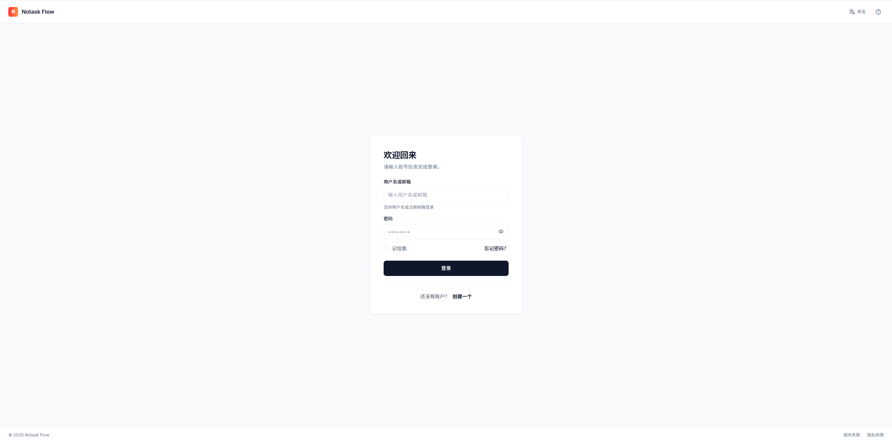
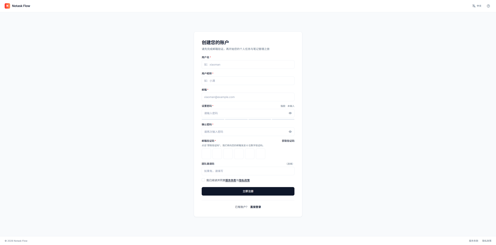
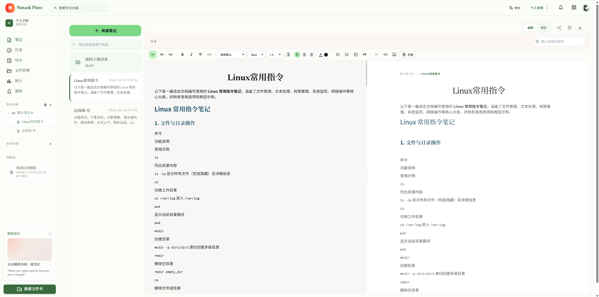
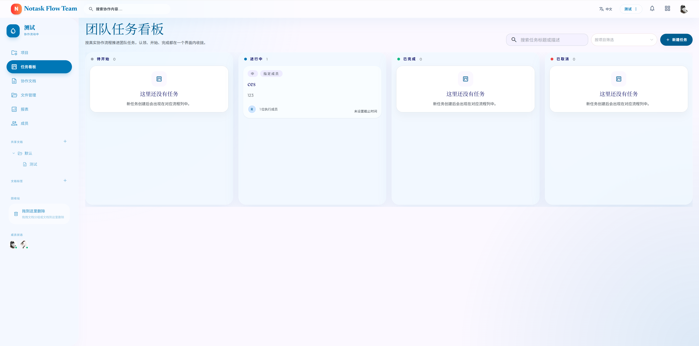
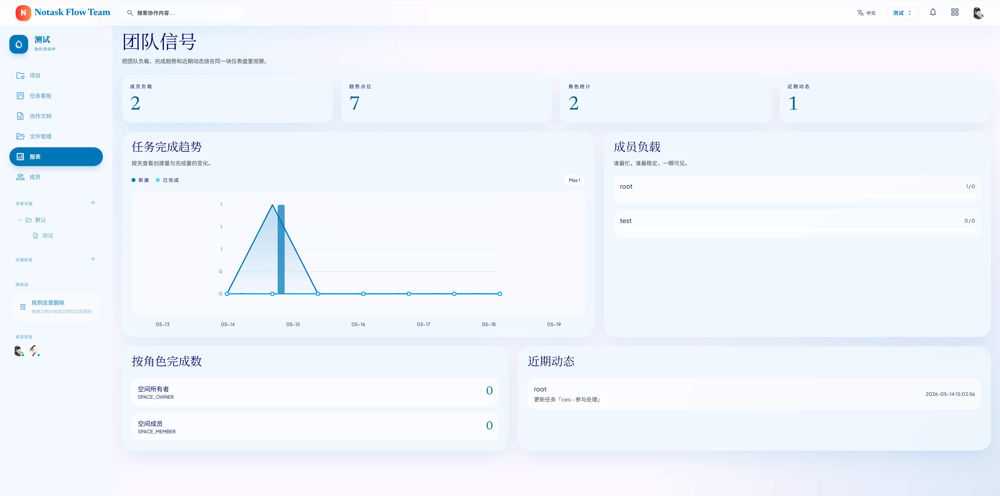
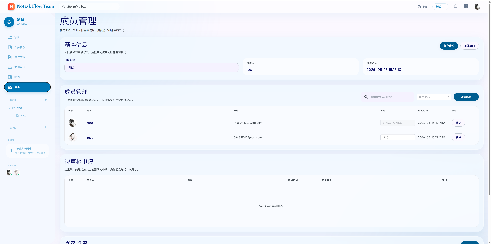
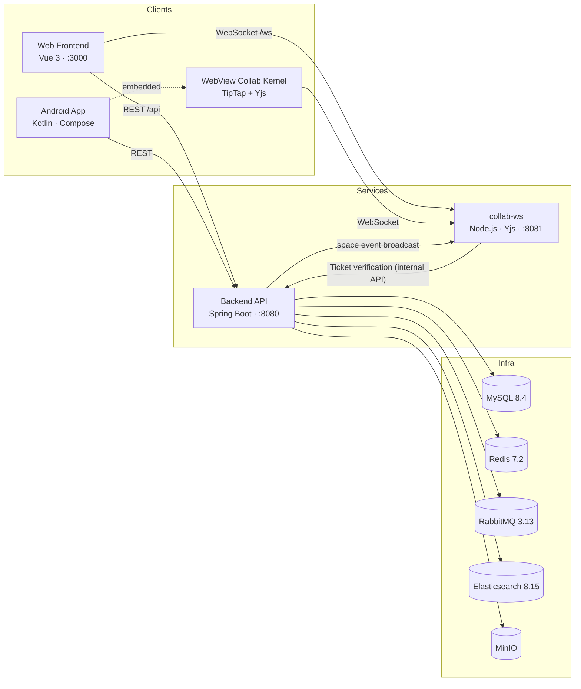

# Notask Flow

> Personal Knowledge Management & Team Task Collaboration Platform

English | [中文](README.md)


## Description

Notask Flow is a multi-platform platform that combines **personal knowledge management** with **team task collaboration**: the personal space covers notes, tasks, todos, files and focus statistics, while the team space covers projects, task kanban, collaborative documents, member management and team reports. Documents are co-edited in real time on all platforms based on Yjs. It addresses a core pain point: personal notes and team tasks scattered across multiple tools, with knowledge unable to connect to tasks, files and collaboration within one space.

## Screenshots

**Web app** (full gallery in [frontend/img/](frontend/img/)):

| Login | Register |
|:---:|:---:|
|  |  |
| **Personal Space · Notes** | **Personal Space · Tasks** |
|  |  |
| **Personal Space · Statistics** | **Team Space · Task Kanban** |
|  |  |
| **Team Space · Document Collaboration** | **Team Space · Project Details** |
|  |  |
| **Team Space · Reports** | **Team Space · Members** |
|  |  |

**Android app** (full gallery in [android/img/](android/img/)):

| Home | Note Editing |
|:---:|:---:|
|  |  |

## Features

- **Personal Space**: Note editing, task management, todo tracking, file management, focus statistics
- **Team Space**: Project management, task kanban, collaborative documents, member management, team reports
- **Real-time Collaboration**: Multi-user document editing based on Yjs (Web and Android share the same collaboration protocol)
- **Multi-platform Support**: Web frontend + Android native client
- **Admin Console**: Platform-level management of users, sessions, storage and system notifications

## System Architecture



Data flow highlights:

- All business REST requests (`Bearer JWT`) go to the Backend; the document collaboration WebSocket connects directly to collab-ws.
- collab-ws authenticates collaborators via a **one-time Ticket + internal API** of the backend; after each transaction commits, the backend pushes space realtime events back to collab-ws for broadcasting.
- The backend depends on five infrastructure components: MySQL (business data), Redis (sessions/JWT), RabbitMQ (async events), Elasticsearch (note & file search) and MinIO (object storage).

## Tech Stack

| Component | Technology |
|-----------|------------|
| Backend | Java 21, Spring Boot 3.2.12, MyBatis-Plus 3.5.7, Sa-Token 1.39.0 |
| Frontend | Vue 3.4, TypeScript 5.5, Vite 5.4, Element Plus 2.8, TipTap 3.22 |
| Android | Kotlin 2.3.21, Jetpack Compose, Hilt, Retrofit, Room |
| Collab Service | Node.js 20, y-websocket, Yjs 13.6 |
| Database | MySQL 8.4, Redis 7.2 |
| Message Queue | RabbitMQ 3.13 |
| Search | Elasticsearch 8.15.5 |
| Storage | MinIO |

## Module Navigation

| Module | Directory | Responsibility | Documentation |
|--------|-----------|----------------|---------------|
| Backend | [`backend/`](backend/) | RESTful API, space-scoped RBAC, business logic, files & search | [English](backend/README_EN.md) · [中文](backend/README.md) |
| Web Frontend | [`frontend/`](frontend/) | User UI and Admin console; also builds the collab editor kernel for Android | [English](frontend/README_EN.md) · [中文](frontend/README.md) |
| Android Client | [`android/`](android/) | Mobile app with an embedded WebView collab editor kernel | [English](android/README_EN.md) · [中文](android/README.md) |
| Deploy & Collab | [`deploy/`](deploy/) | Docker Compose orchestration, Nginx, Yjs collab WebSocket service | [English](deploy/README_EN.md) · [中文](deploy/README.md) |

> The only cross-module build dependency: running `npm run build:android-collab` in the frontend outputs the collab editor kernel to `android/app/src/main/assets/notask_collab/`. Rebuild and sync to the Android project after changing the editor kernel.

## Prerequisites

- **Docker deployment**: Docker Engine 24+ and Docker Compose v2 — nothing else needed
- **Local development** (as needed):
  - Backend: JDK 21, Maven 3.9+
  - Frontend: Node.js ≥ 18 (20+ recommended)
  - Android: Android Studio, JDK 21, Android SDK 35

See each module's README for detailed version requirements.

## Quick Start

### Docker Deployment (Recommended)

```bash
git clone git@github.com:AtaraxyEcho/notask-flow.git
cd notask-flow
cp deploy/prod/.env.example deploy/prod/.env
# Edit deploy/prod/.env and change all passwords and secrets (checklist in deploy/README.md)
cd deploy/prod
docker compose --profile app up -d
```

Visit `http://localhost:3000` once started; the backend API docs are at `http://localhost:8080/swagger-ui/index.html`.

### Local Development

```bash
# 1. Start infrastructure (MySQL/Redis/RabbitMQ/ES/MinIO/collab-ws; schema auto-initialized on first run)
cd deploy/dev && cp .env.example .env && docker compose up -d
cd ../..

# 2. Start the backend (in a new terminal; optional: copy backend/.env.example to backend/.env)
cd backend && mvn spring-boot:run
```

```bash
# 3. Start the frontend (in another terminal)
cd frontend && cp .env.example .env && npm install && npm run dev
```

Visit `http://localhost:3000`. The dev admin account defaults to `Administrator / change-me` (see `deploy/dev/.env.example`).

For Android development see [android/README_EN.md](android/README_EN.md#quick-start).

## Configuration

This repository has **no global root `.env`**. All environment variable templates live next to their modules — copy the corresponding `.example` file and edit it as needed (variable meanings are documented in each module's README, not repeated here):

| Module | Template Files | Purpose |
|--------|----------------|---------|
| Deploy | `deploy/dev/.env.example`, `deploy/prod/.env.example` | Container ports, DB/middleware credentials, JWT, collab service token |
| Backend | `backend/.env.example` | dev-profile local connections (MySQL/Redis/RabbitMQ/ES/MinIO/JWT) |
| Frontend | `frontend/.env.example` | API & WebSocket base paths, dev proxy targets |
| Android | `android/gradle.properties.example`, `android/local.properties.example` | SDK path, API/WebSocket URLs |

## Contributing

- Read the Java / Kotlin coding standards in [AGENTS.md](AGENTS.md) before committing; all source files must be UTF-8 encoded.
- Develop on feature branches and open Pull Requests against `main`; describe the motivation and how you verified the change.
- Report bugs and suggest features via Issues, including reproduction steps and relevant logs.

## License

This project is licensed under the [GNU Affero General Public License v3.0](LICENSE).

---

Last Updated: 2026-09-04
