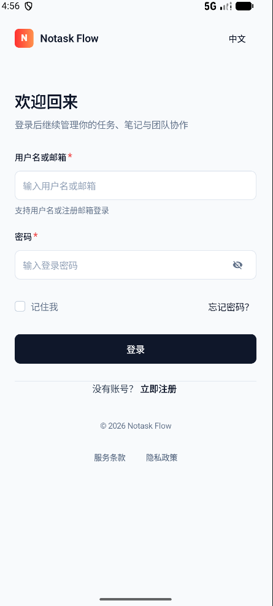
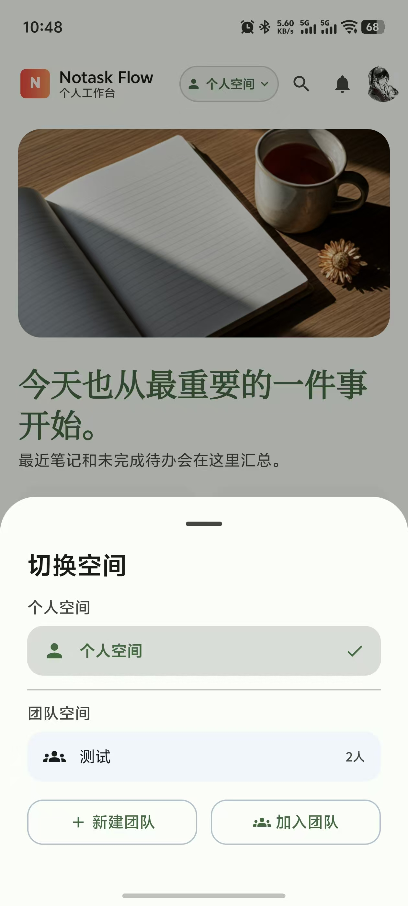
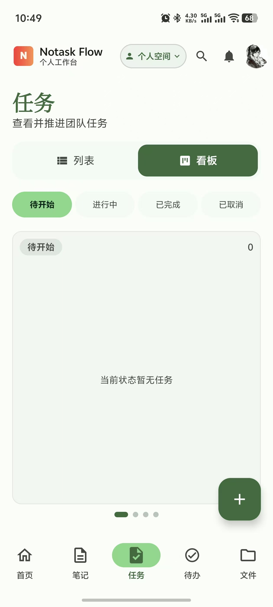
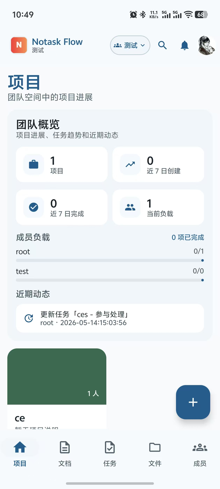
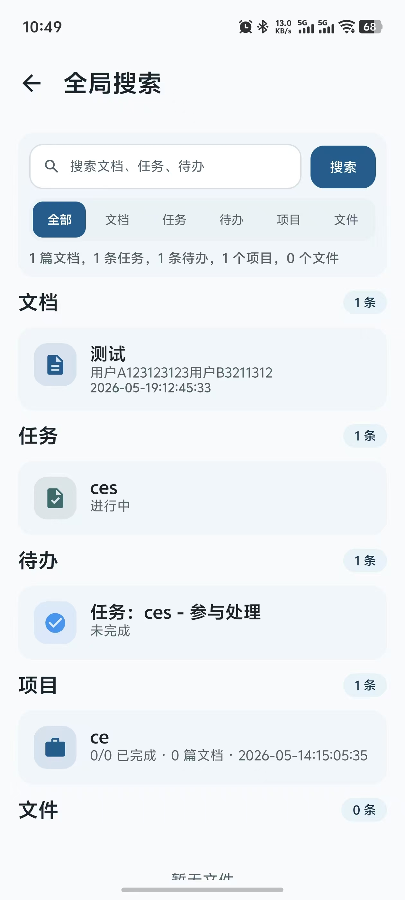
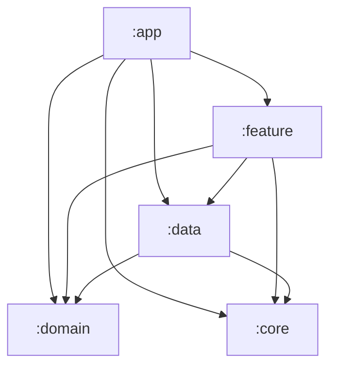

# Notask Flow Android

> Kotlin Android 原生客户端

中文 | [English](README_EN.md)

---

## 简介

Android 端提供笔记、任务、待办、项目、文件、统计等原生界面;文档协作用 WebView 加载由前端构建的 Yjs 编辑内核,与 Web 端共用同一套协同协议。`minSdk 26`(Android 8.0),适配手机与平板,无需 Google Play Services。

## 界面预览

完整截图见 [img/](img/):

|            登录            | 首页 |
|:------------------------:|:---:|
|    |  |
|          **任务**          | **笔记编辑** |
|     |  |
|          **项目**          | **全局搜索** |
|  |  |

## 技术栈

| 组件 | 技术 |
|------|------|
| 语言 | Kotlin 2.3.21 |
| UI | Jetpack Compose(Compose BOM 2025.01.00)、Material 3 |
| 架构 | Clean Architecture + MVVM |
| 依赖注入 | Hilt 2.59.2 |
| 网络 | Retrofit 2.11、OkHttp 4.12、Moshi 1.15.1(KSP codegen) |
| 本地存储 | Room 2.7、DataStore 1.1.1 |
| 异步 | Coroutines 1.8.1、WorkManager 2.9.1 |
| 分页/图片 | Paging 3.3、Coil 3.0 |
| 构建 | AGP 9.2.0、Gradle 9.4.1(wrapper,已配华为云镜像)、Java 21、版本目录 `libs.versions.toml` |
| 测试 | JUnit 5、MockK、Turbine |

## 模块结构

```
android/
├── app/        # 应用入口、导航图、FileProvider、协作 WebView 资产
├── core/       # 通用基础:common / database / datastore / model / network / testing / ui
├── data/       # 各领域 api、DTO、Repository、Hilt Module;BuildConfig 在此模块
├── domain/     # 领域模型、业务策略(policy);纯 Kotlin,不依赖 Android 框架与其他项目模块
└── feature/    # 按功能拆分的界面与 ViewModel:auth、note、task、todo、project 等 15 个
```



## 环境依赖

- Android Studio(建议较新稳定版,需支持 AGP 9.x)
- JDK 21
- Android SDK 35(compileSdk / targetSdk 均为 35)
- Gradle 无需手装,使用 wrapper(首次构建自动下载;已配置阿里云 Maven 镜像与华为云 Gradle 分发镜像)

## 快速开始

```bash
# 1. 首次构建前,先完成下方「配置」两步
# 2. Android Studio 打开 android/ 目录,或命令行:
./gradlew.bat :app:assembleDebug     # Windows
./gradlew :app:assembleDebug         # macOS / Linux
```

APK 产物在 `app/build/outputs/apk/debug/`。运行测试:

```bash
./gradlew test    # 全部模块单元测试(JUnit 5 平台)
```

## 配置

真实 `gradle.properties` 与 `local.properties` 均被 Git 忽略,首次构建前从模板复制:

```bash
cp gradle.properties.example gradle.properties
cp local.properties.example local.properties   # Android Studio 通常会自动生成本文件
```

- **`local.properties`**:`sdk.dir` 指向本机 Android SDK 路径。
- **`gradle.properties`**:JVM 内存(`org.gradle.jvmargs`)与 API/WebSocket 地址。地址经 `data/build.gradle.kts` 的 buildTypes 注入 `BuildConfig`,debug 与 release 自动区分:

  | Gradle 属性 | 注入到 | 默认值(模拟器) |
  |-------------|--------|------------------|
  | `notask.debugApiBaseUrl` | debug `BuildConfig.BASE_URL` | `http://10.0.2.2:8080/` |
  | `notask.debugCollabWsUrl` | debug `BuildConfig.COLLAB_WS_URL` | `ws://10.0.2.2:3000/ws` |
  | `notask.releaseApiBaseUrl` | release `BuildConfig.BASE_URL` | 需改为 HTTPS 生产域名 |
  | `notask.releaseCollabWsUrl` | release `BuildConfig.COLLAB_WS_URL` | 通常为同一域名的 `wss://` |

  环境切换方式:改 `gradle.properties` 后重新构建即可;**真机调试把 `10.0.2.2` 换成电脑局域网 IP**。

## 签名与混淆

- **签名**:当前工程**未配置 `signingConfigs`**,release 构建暂用默认调试签名。正式发布前需自行在 `app/build.gradle.kts` 添加 `signingConfigs`(keystore 文件路径与口令放 `local.properties` 或 CI 密钥变量读取,**严禁将任何真实密钥提交到仓库**)。
- **混淆**:release 已启用 `minifyEnabled`,规则在 `app/proguard-rules.pro`(keep 住了 Moshi 生成的 JsonAdapter 与被 `@JsonClass` 注解的模型类、枚举等),自定义规则也加在该文件。

## 三方 SDK 与密钥

本项目**不包含** FCM/推送、地图、分享等需要申请 `app_key` 的第三方 SDK,也没有 Google Play Services 依赖(模拟器无需 Play 镜像)。Manifest 权限仅 `INTERNET`。若后续引入此类 SDK,密钥统一放 `local.properties` 并经 BuildConfig 注入。

## 协作编辑器

`app/src/main/assets/notask_collab/` 下的 `editor.js` **不是手写代码**,由前端 `npm run build:android-collab` 生成(见 [frontend/README.md](../frontend/README.md))。原生侧(`feature/note/NoteEditRoute.kt`)通过 WebView 加载该内核,经 NativeBridge 回调通信;WebSocket 连接由内核内 JS 直连 collab-ws。不要手工修改 assets 下的产物。

## 网络安全配置

`app/src/main/res/xml/network_security_config.xml` 默认禁止明文 HTTP;debug 源集(`app/src/debug/res`)覆盖为允许,便于连本地 HTTP 后端。release 构建强制 HTTPS,`notask.releaseApiBaseUrl` 必须是 `https://`。

## 测试

```bash
./gradlew test    # 全模块(JUnit 5 平台,已统一 useJUnitPlatform)
```

测试栈为 JUnit Jupiter + MockK + Turbine;当前测试覆盖有限(如 domain 模块的 `TaskActionPolicyTest`),新代码请补充 ViewModel / Repository / UseCase 层测试。

## 排障速查

| 现象 | 检查项 |
|------|--------|
| 无法连接后端 | `notask.debugApiBaseUrl` 是否正确,后端是否启动 |
| 模拟器可用真机不可用 | 真机不能用 `10.0.2.2`,需换成电脑局域网 IP |
| 协作文档不同步 | `notask.debugCollabWsUrl` 是否指向 collab-ws(直连 8081 `/ws` 或经前端 3000 代理) |
| 构建报 JDK 版本错误 | 确认 JDK 21:Studio 内设置 Gradle JDK,或 `org.gradle.java.home` |
| 首次构建卡在下载依赖 | 已配置阿里云镜像,检查网络/代理 |

---

Last Updated: 2026-09-06
