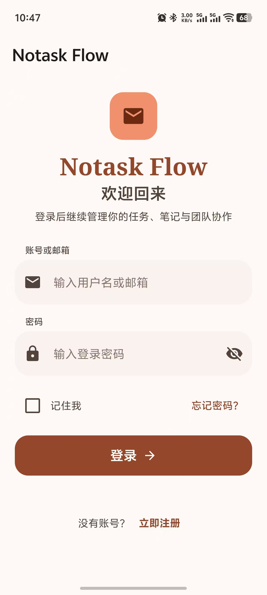
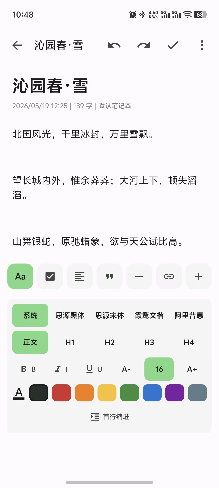
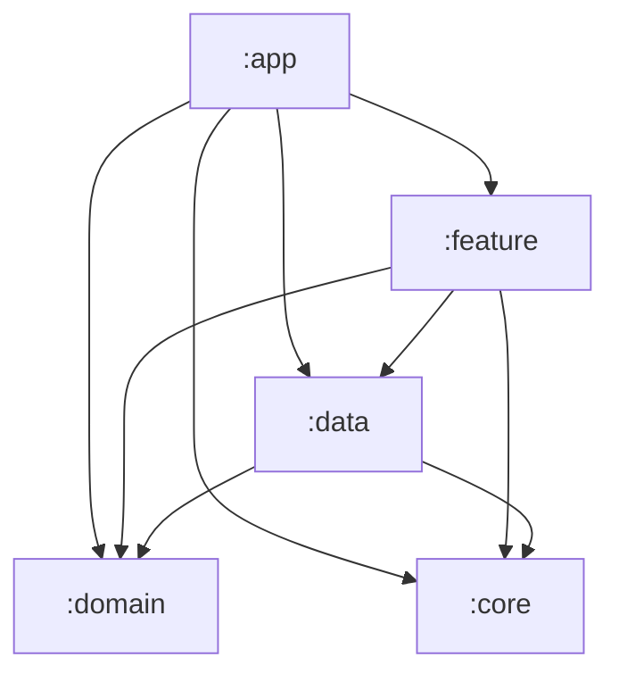

# Notask Flow Android

> Kotlin Android native client

[中文](README.md) | English

---

## Description

The Android app provides native screens for notes, tasks, todos, projects, files and statistics; document collaboration loads a Yjs editor kernel built by the frontend inside a WebView, sharing the same collaboration protocol as Web. `minSdk 26` (Android 8.0), supports phones and tablets, no Google Play Services required.

## Screenshots

Full gallery in [img/](img/):

| Login | Home |
|:---:|:---:|
|  |  |
| **Tasks** | **Note Editing** |
|  |  |
| **Projects** | **Global Search** |
|  |  |

## Tech Stack

| Component | Technology |
|-----------|------------|
| Language | Kotlin 2.3.21 |
| UI | Jetpack Compose (BOM 2025.01.00), Material 3 |
| Architecture | Clean Architecture + MVVM |
| DI | Hilt 2.59.2 |
| Network | Retrofit 2.11, OkHttp 4.12, Moshi 1.15.1 (KSP codegen) |
| Storage | Room 2.7, DataStore 1.1.1 |
| Async | Coroutines 1.8.1, WorkManager 2.9.1 |
| Paging/Images | Paging 3.3, Coil 3.0 |
| Build | AGP 9.2.0, Gradle 9.4.1 (wrapper, Huawei Cloud mirror), Java 21, version catalog `libs.versions.toml` |
| Testing | JUnit 5, MockK, Turbine |

## Module Structure

```
android/
├── app/        # App entry, navigation graph, FileProvider, collab WebView assets
├── core/       # Foundations: common / database / datastore / model / network / testing / ui
├── data/       # Per-domain api, DTO, Repository, Hilt modules; BuildConfig lives here
├── domain/     # Domain models, business policies; pure Kotlin, no Android framework or project deps
└── feature/    # Per-feature screens and ViewModels: auth, note, task, todo, project, etc. (15)
```



## Prerequisites

- Android Studio (a recent stable build that supports AGP 9.x)
- JDK 21
- Android SDK 35 (both compileSdk and targetSdk are 35)
- No manual Gradle install — the wrapper downloads it on first build (Aliyun Maven mirrors and a Huawei Cloud Gradle distribution mirror are preconfigured)

## Quick Start

```bash
# 1. Complete the "Configuration" steps below before the first build
# 2. Open the android/ directory in Android Studio, or use the CLI:
./gradlew.bat :app:assembleDebug     # Windows
./gradlew :app:assembleDebug         # macOS / Linux
```

The APK lands in `app/build/outputs/apk/debug/`. Run tests:

```bash
./gradlew test    # unit tests for all modules (JUnit 5 platform)
```

## Configuration

Real `gradle.properties` and `local.properties` are Git-ignored; copy from the templates before the first build:

```bash
cp gradle.properties.example gradle.properties
cp local.properties.example local.properties   # Android Studio usually creates this one automatically
```

- **`local.properties`**: `sdk.dir` pointing to your Android SDK.
- **`gradle.properties`**: JVM memory (`org.gradle.jvmargs`) and the API/WebSocket URLs. They are injected as `BuildConfig` fields by the buildTypes in `data/build.gradle.kts`, automatically split between debug and release:

  | Gradle Property | Injected Into | Default (emulator) |
  |-----------------|---------------|--------------------|
  | `notask.debugApiBaseUrl` | debug `BuildConfig.BASE_URL` | `http://10.0.2.2:8080/` |
  | `notask.debugCollabWsUrl` | debug `BuildConfig.COLLAB_WS_URL` | `ws://10.0.2.2:3000/ws` |
  | `notask.releaseApiBaseUrl` | release `BuildConfig.BASE_URL` | change to your HTTPS production domain |
  | `notask.releaseCollabWsUrl` | release `BuildConfig.COLLAB_WS_URL` | usually `wss://` on the same domain |

  To switch environments, edit `gradle.properties` and rebuild; **for physical devices replace `10.0.2.2` with your computer's LAN IP**.

## Signing & Minification

- **Signing**: no `signingConfigs` is configured yet — release builds currently fall back to the default debug signing. Before an official release, add a `signingConfigs` block in `app/build.gradle.kts` yourself (read the keystore path and passwords from `local.properties` or CI secret variables; **never commit real keys to the repository**).
- **Minification**: release enables `minifyEnabled`; rules live in `app/proguard-rules.pro` (keeps Moshi-generated JsonAdapters and `@JsonClass`-annotated models, enums, etc.). Add custom rules to the same file.

## Third-party SDKs & Keys

This project ships **no** FCM/push, maps or share SDKs that require an `app_key`, and no Google Play Services dependency (emulators don't need a Play image). The manifest declares only `INTERNET`. If such SDKs are added later, keep their keys in `local.properties` and inject via BuildConfig.

## Collab Editor

`editor.js` under `app/src/main/assets/notask_collab/` is **not hand-written** — it is generated by the frontend's `npm run build:android-collab` (see [frontend/README_EN.md](../frontend/README_EN.md)). The native side (`feature/note/NoteEditRoute.kt`) loads this kernel in a WebView and communicates via NativeBridge callbacks; the WebSocket connection is made by the JS kernel directly to collab-ws. Never hand-edit the assets output.

## Network Security Configuration

`app/src/main/res/xml/network_security_config.xml` blocks cleartext HTTP by default; the debug source set (`app/src/debug/res`) overrides it to allow plain HTTP for local backends. Release builds enforce HTTPS — `notask.releaseApiBaseUrl` must be `https://`.

## Testing

```bash
./gradlew test    # all modules (JUnit 5 platform, useJUnitPlatform configured)
```

The test stack is JUnit Jupiter + MockK + Turbine; coverage is currently limited (e.g. `TaskActionPolicyTest` in the domain module). New code should add ViewModel / Repository / UseCase tests.

## Troubleshooting

| Issue | Check |
|-------|-------|
| Cannot connect to backend | `notask.debugApiBaseUrl` correct? Backend running? |
| Works on emulator but not device | Physical devices can't use `10.0.2.2` — use the computer's LAN IP |
| Collab document not syncing | `notask.debugCollabWsUrl` points to collab-ws (direct :8081 `/ws`, or via the frontend proxy on :3000)? |
| Build fails with a JDK version error | Confirm JDK 21: set Gradle JDK in Studio settings, or `org.gradle.java.home` |
| First build stuck downloading dependencies | Aliyun mirrors are preconfigured; check network/proxy |

---

Last Updated: 2026-09-04
