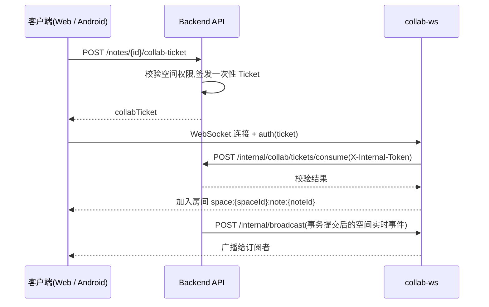

# Notask Flow Backend

> Spring Boot 后端 API 服务

中文 | [English](README_EN.md)

---

## 简介

后端是平台所有业务能力的交付者与数据的守护者,围绕**空间(Space)**组织一切资源:所有笔记、任务、待办、文件均归属某个空间,权限按空间隔离。它提供 RESTful API、基于 Sa-Token JWT 的空间级 RBAC 鉴权、Elasticsearch 搜索索引、MinIO 对象存储,以及与 [collab-ws](../deploy/README.md) 协同服务的内部集成。

### 功能模块

| 模块 | 说明 |
|------|------|
| 认证与用户 | 注册/登录/找回密码、单设备登录、设备令牌、登录日志 |
| 空间与权限 | 个人/团队空间、成员管理、4 级空间角色(SPACE_OWNER/ADMIN/MEMBER/GUEST)、17 项权限点、加入申请与邀请 |
| 项目与任务 | 项目、任务看板、子任务分配、任务状态机、乐观锁并发控制、任务评论与 @提及 |
| 待办 | 个人待办,与任务成员子任务同事务强一致同步 |
| 笔记与知识库 | 笔记本、笔记、标签、版本历史(自动保留最近 50 版)、浏览量统计 |
| 评论与通知 | 站内通知、通知设置、邮件通知(邀请/提醒) |
| 文件管理 | 文件夹、分片上传、MIME 白名单、附件多处引用(`reference_key`)、回收站(30 天保留)与定时清理 |
| 搜索 | Elasticsearch 笔记与文件全文检索 |
| 统计 | 专注/任务/笔记多维统计 |
| 管理后台 | 用户、会话、存储、系统设置、系统通知、登录日志、操作日志、监控等 9 个管理控制器 |
| 协作集成 | 协作 Ticket 签发与校验、空间实时事件外推 |

## 技术栈

| 组件 | 技术 |
|------|------|
| 语言 | Java 21 |
| 框架 | Spring Boot 3.2.12 |
| ORM | MyBatis-Plus 3.5.7 |
| 认证 | Sa-Token 1.39.0(JWT + Redis 会话) |
| API 文档 | springdoc-openapi 2.3.0 |
| 数据库 | MySQL 8.4 |
| 缓存 | Redis 7.2 |
| 消息队列 | RabbitMQ 3.13 |
| 搜索 | Elasticsearch 8.15.5 |
| 存储 | MinIO 8.5.12 |
| 文档解析 | Apache Tika 3.3、docx4j 11.5、openhtmltopdf 1.1(导入导出与文本提取) |

## 项目结构

```
backend/
├── src/main/java/com/notaskflow/
│   ├── common/          # ApiResponse、分页、枚举、常量
│   ├── config/          # Spring 配置(18 个:CORS、Sa-Token、Redis、MQ、ES、MinIO、OpenAPI...)
│   ├── controller/      # REST 控制器(28 个,其中管理端 9 个)
│   ├── domain/          # entity(32) / dto / query / vo / document(ES 文档)
│   ├── mapper/          # MyBatis-Plus Mapper(32 个)
│   ├── service/         # 业务接口与实现(约 38 对)
│   ├── security/        # StpInterfaceImpl、SpaceContextInterceptor、CSRF、安全响应头
│   ├── event/ listener/ # 领域事件定义 + AFTER_COMMIT 事务事件监听
│   ├── mq/              # RabbitMQ 生产者/消费者(邮件、通知、索引、统计、失败重试)
│   ├── job/             # 定时任务:回收站清理、事件失败重试、浏览量刷库
│   ├── exception/       # 全局异常处理器 + 业务异常层次
│   └── storage/ utils/  # MinIO 存储封装、工具类
├── src/main/resources/
│   ├── application.yml          # 主配置(dev/prod/docker 三 profile)
│   ├── application-dev.yml      # 本地开发(支持读取 backend/.env)
│   ├── application-prod.yml     # 生产(凭据必须由环境变量提供)
│   ├── application-docker.yml   # Docker 构建
│   ├── log4j2-spring.xml        # 日志(滚动文件,保留 30 天)
│   └── db/                      # schema.sql(31 表)+ data.sql(种子数据)
└── pom.xml
```

## 架构要点

- **分层结构**:Controller → Service → Mapper,领域模型分 DO / DTO / VO / Query。
- **空间级 RBAC**:所有资源归属 `Space`,权限经 `security/StpInterfaceImpl` 按 `nt_space_member` → `nt_role_permission` 动态计算,入口拦截见 `security/SpaceContextInterceptor`。
- **事件驱动**:领域事件经 `ApplicationEventPublisher` 发布,`@TransactionalEventListener(AFTER_COMMIT)` + RabbitMQ 异步处理(邮件、通知、搜索索引、统计),失败事件落库由定时任务重试。
- **任务状态机**:枚举驱动 + 条件更新(`eq(expectedStatus)`),`nt_task_member` 使用 version 乐观锁;成员完成子任务时在同一事务内同步待办。
- **文档协同**(与 collab-ws 的集成模式,后端不承载 WebSocket):



## 环境依赖

- JDK 21、Maven 3.9+
- 基础设施(MySQL/Redis/RabbitMQ/Elasticsearch/MinIO):推荐用 [`deploy/dev`](../deploy/README.md) 的 Docker Compose 一键启动;也可自备同等版本实例

## 快速启动

```bash
# 1. 从 backend/ 目录启动基础设施(首次启动自动导入 schema.sql / data.sql)
cd ../deploy/dev && cp .env.example .env && docker compose up -d

# 2. 回到 backend/ 启动后端
cd ../backend
mvn spring-boot:run
```

启动成功后访问 API 文档:`http://localhost:8080/swagger-ui/index.html`。

## 数据库初始化

脚本位于 `src/main/resources/db/`:

| 脚本 | 内容 |
|------|------|
| `schema.sql` | 31 张 `nt_` 前缀表(含索引与约束),`utf8mb4` / InnoDB |
| `data.sql` | 种子数据:4 个空间角色、17 条权限及角色-权限映射、系统设置 |

说明:

- `spring.sql.init.mode=never`,后端**不会**自动执行脚本。
- `deploy/dev` 的 compose 已将两个脚本挂载到 MySQL 初始化目录,**首次**以空数据卷启动时自动导入;之后再改脚本不会重放,需手动执行或删除数据卷重建。
- 手动导入:

  ```bash
  mysql -h127.0.0.1 -unotask -p notask_flow < src/main/resources/db/schema.sql
  mysql -h127.0.0.1 -unotask -p notask_flow < src/main/resources/db/data.sql
  ```

### 数据库规范

- 表前缀 `nt_`,命名小写 + 下划线;索引命名 `pk_` / `uk_` / `idx_`。
- 每表必备字段:`gmt_create`、`gmt_modified`、`is_deleted`(tinyint(1),逻辑删除,由 MyBatis-Plus 自动过滤)。
- 用户删除采用"改写唯一字段 + 逻辑删除"策略,避免 `username` / `email` 唯一约束冲突。

## API 规范

- 基础路径 `/api/v1`,认证 `Authorization: Bearer <jwt>`。
- 响应统一为 `ApiResponse`,HTTP 状态码始终 200,业务状态在 `code` 字段:

  ```json
  { "code": 200, "message": "success", "data": { } }
  ```

- 分页参数:`pageNum`(默认 1)、`pageSize`(默认 10,最大 100)。
- 错误码段位:`1xxx` 系统、`2xxx` 任务、`3xxx` 笔记、`4xxx` 文件。
- API 文档:Swagger UI `http://localhost:8080/swagger-ui/index.html`,OpenAPI JSON `/v3/api-docs`,页面右上角 Authorize 填入 `Bearer <jwt>`。

## 配置说明

Profile 由 `SPRING_PROFILES_ACTIVE` 控制,默认 `dev`:

| Profile | 用途 | 说明 |
|---------|------|------|
| `dev` | 本地开发 | 指向 `127.0.0.1`,支持通过 `spring.config.import` 读取 `backend/.env` 文件 |
| `prod` | 生产部署 | 主机名为容器名,凭据**必须**由环境变量提供,无默认值 |
| `docker` | Docker 构建 | 容器主机名 + 默认凭据,供 `deploy/prod` 镜像使用 |

关键配置项索引(具体值请看配置文件本身,此处只列名称与作用):

| 配置项 | 位置 | 作用 |
|--------|------|------|
| `server.port` | `application.yml` | 服务端口,默认 8080 |
| `SA_TOKEN_JWT_SECRET` | `application.yml` | JWT 签名密钥,变更后所有会话失效 |
| `sa-token.timeout` | `application.yml` | 登录有效期,默认 14400s |
| `FILE_MAX_SIZE` | `application.yml` | 单文件上传上限,默认 50MB |
| `notask-flow.file.*` | `application.yml` | 分片上传(chunk-size 5MB)、回收站保留天数(30 天)与每日 3 点定时清理 |
| `spring.mail.*` / `NOTASK_MAIL_FROM` | `application.yml` | SMTP 邮件发送(验证码/通知),未配置则邮件功能不可用 |
| `INVITE_DEFAULT_EXPIRE_MINUTES` | `application.yml` | 团队邀请码默认有效期,默认 30 分钟 |
| `SA_TOKEN_IS_SHARE` / `REDIS_DATABASE` | `application.yml` | 会话共享开关与 Redis 逻辑库 |
| `SECURITY_ALLOWED_ORIGINS` | `application.yml` | CORS 允许的前端来源,逗号分隔 |
| `notask-flow.security.allowed-origins` | `application.yml` | CORS 白名单 |
| `notask-flow.collab.*` | `application.yml` | 协同集成:`internal-token`(内部鉴权)、`realtime-broadcast-url`(事件推送到 collab-ws) |
| `notask-flow.admin.*` | `application.yml` | 管理后台初始账号 |
| `spring.mail.*` / `notask-flow.mail.*` | `application.yml` | 邮件通知(默认 SMTP 465 SSL) |
| `notask-flow.minio.*` | `application-dev.yml` | MinIO 端点、凭据、桶名与 MIME 白名单 |

本地开发环境变量模板:复制 [`backend/.env.example`](.env.example) 为 `backend/.env`(dev profile 自动读取)。完整变量清单与默认值见 `application*.yml` 与 [`deploy/dev/.env.example`](../deploy/dev/.env.example)。

## 异步与定时任务

- **RabbitMQ 消费者**(7 组):文件处理、邮件、通知、搜索索引、统计刷新、任务事件、失败重试,均为手动 ack + 3 次重试。
- **定时任务**(3 个):文件回收站清理(每日 03:00)、事件失败重试、笔记浏览量刷库。

## 测试

```bash
mvn test
```

测试脚手架已就绪(H2 + spring-boot-starter-test),当前仓库尚未提交测试类,新代码请遵循 AAA 模式与描述性命名。

## 排障速查

| 现象 | 检查项 |
|------|--------|
| MySQL 连接失败 | 容器是否启动(`docker compose ps`),`MYSQL_*` 凭据是否与 `deploy/dev/.env` 一致 |
| Redis 认证失败 | `REDIS_PASSWORD` 是否匹配 |
| 登录后被踢回登录页 | `SA_TOKEN_JWT_SECRET` 是否变化(变更后旧会话全部失效) |
| 协作文档打不开/不同步 | `COLLAB_INTERNAL_TOKEN` 是否与 collab-ws 一致,`COLLAB_REALTIME_BROADCAST_URL` 是否指向 collab-ws 的 `/internal/broadcast` |
| 文件上传 413 | `FILE_MAX_SIZE` 与反向代理(client_max_body_size)是否放行 |
| 搜索无结果 | ES 是否健康(`curl localhost:9200`),索引是否已由 MQ 消费者建立 |

---

Last Updated: 2026-09-06
