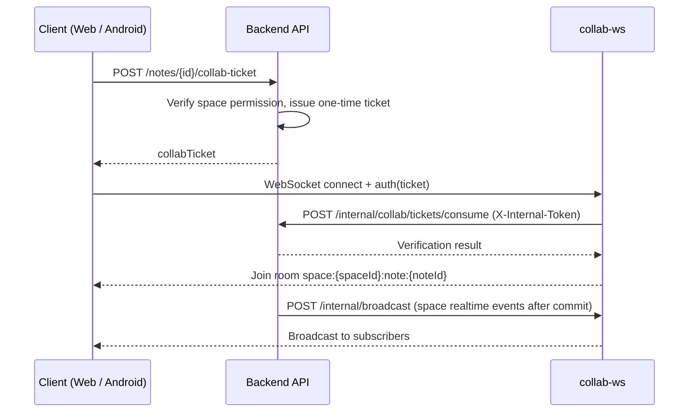

# Notask Flow Backend

> Spring Boot backend API service

[中文](README.md) | English

---

## Description

The backend delivers all business capabilities and guards the data, organized around **Spaces**: every note, task, todo and file belongs to a space, with permissions isolated per space. It provides RESTful APIs, space-scoped RBAC with Sa-Token JWT, Elasticsearch search indexing, MinIO object storage, and internal integration with the [collab-ws](../deploy/README.md) collaboration service.

### Feature Modules

| Module | Description |
|--------|-------------|
| Auth & Users | Register/login/password reset, single-device login, device tokens, login logs |
| Spaces & Permissions | Personal/team spaces, member management, 4 space roles (SPACE_OWNER/ADMIN/MEMBER/GUEST), 17 permission points, join requests & invitations |
| Projects & Tasks | Projects, task kanban, subtask assignment, task state machine, optimistic-lock concurrency, task comments & @mentions |
| Todos | Personal todos, transactionally synced with task member subtasks for strong consistency |
| Notes & Knowledge | Notebooks, notes, tags, version history (last 50 kept automatically), view counts |
| Comments & Notifications | In-app notifications, notification settings, email notifications (invites/reminders) |
| File Management | Folders, chunked upload, MIME whitelist, multi-reference attachments (`reference_key`), trash (30-day retention) with scheduled cleanup |
| Search | Elasticsearch full-text search for notes and files |
| Statistics | Focus/task/note multi-dimensional statistics |
| Admin Console | 9 admin controllers: users, sessions, storage, system settings, system notifications, login logs, operation logs, monitoring, etc. |
| Collab Integration | Collab ticket issuing & verification, space realtime event forwarding |

## Tech Stack

| Component | Technology |
|-----------|------------|
| Language | Java 21 |
| Framework | Spring Boot 3.2.12 |
| ORM | MyBatis-Plus 3.5.7 |
| Auth | Sa-Token 1.39.0 (JWT + Redis session) |
| API Docs | springdoc-openapi 2.3.0 |
| Database | MySQL 8.4 |
| Cache | Redis 7.2 |
| Message Queue | RabbitMQ 3.13 |
| Search | Elasticsearch 8.15.5 |
| Storage | MinIO 8.5.12 |
| Document Parsing | Apache Tika 3.3, docx4j 11.5, openhtmltopdf 1.1 (import/export & text extraction) |

## Project Structure

```
backend/
├── src/main/java/com/notaskflow/
│   ├── common/          # ApiResponse, paging, enums, constants
│   ├── config/          # Spring configuration (18: CORS, Sa-Token, Redis, MQ, ES, MinIO, OpenAPI...)
│   ├── controller/      # REST controllers (28, of which 9 admin)
│   ├── domain/          # entity (32) / dto / query / vo / document (ES docs)
│   ├── mapper/          # MyBatis-Plus mappers (32)
│   ├── service/         # Business interfaces & impls (~38 pairs)
│   ├── security/        # StpInterfaceImpl, SpaceContextInterceptor, CSRF, security headers
│   ├── event/ listener/ # Domain events + AFTER_COMMIT transactional listeners
│   ├── mq/              # RabbitMQ producers/consumers (mail, notifications, indexing, stats, retry)
│   ├── job/             # Scheduled jobs: trash cleanup, event retry, view-count flush
│   ├── exception/       # Global exception handler + business exception hierarchy
│   └── storage/ utils/  # MinIO storage wrapper, utilities
├── src/main/resources/
│   ├── application.yml          # Main config (dev/prod/docker profiles)
│   ├── application-dev.yml      # Local development (reads backend/.env)
│   ├── application-prod.yml     # Production (credentials must come from env vars)
│   ├── application-docker.yml   # Docker build
│   ├── log4j2-spring.xml        # Logging (rolling files, 30-day retention)
│   └── db/                      # schema.sql (31 tables) + data.sql (seed data)
└── pom.xml
```

## Architecture Highlights

- **Layering**: Controller → Service → Mapper; domain models split into DO / DTO / VO / Query.
- **Space-scoped RBAC**: every resource belongs to a `Space`; permissions are computed dynamically via `security/StpInterfaceImpl` from `nt_space_member` → `nt_role_permission`, with entry interception in `security/SpaceContextInterceptor`.
- **Event-driven**: domain events published via `ApplicationEventPublisher`, processed asynchronously by `@TransactionalEventListener(AFTER_COMMIT)` + RabbitMQ (mail, notifications, search indexing, statistics); failed events are persisted and retried by a scheduled job.
- **Task state machine**: enum-driven with conditional updates (`eq(expectedStatus)`); `nt_task_member` uses version-based optimistic locking; completing a member subtask syncs the linked todo within the same transaction.
- **Document collaboration** (integration pattern with collab-ws; the backend hosts no WebSocket):



## Prerequisites

- JDK 21, Maven 3.9+
- Infrastructure (MySQL/Redis/RabbitMQ/Elasticsearch/MinIO): easiest via the Docker Compose in [`deploy/dev`](../deploy/README.md); or bring your own instances of the same versions

## Quick Start

```bash
# 1. From backend/, start the infrastructure (schema.sql / data.sql imported automatically on first run)
cd ../deploy/dev && cp .env.example .env && docker compose up -d

# 2. Return to backend/ and start the backend
cd ../backend
mvn spring-boot:run
```

API docs once running: `http://localhost:8080/swagger-ui/index.html`.

## Database Initialization

Scripts live in `src/main/resources/db/`:

| Script | Content |
|--------|---------|
| `schema.sql` | 31 `nt_`-prefixed tables (indexes & constraints), `utf8mb4` / InnoDB |
| `data.sql` | Seed data: 4 space roles, 17 permissions with role mappings, system settings |

Notes:

- `spring.sql.init.mode=never` — the backend **never** executes the scripts automatically.
- The `deploy/dev` compose mounts both scripts into the MySQL init directory, so they are imported **only on the first** start with an empty data volume; later script changes are not replayed — run them manually or recreate the volume.
- Manual import:

  ```bash
  mysql -h127.0.0.1 -unotask -p notask_flow < src/main/resources/db/schema.sql
  mysql -h127.0.0.1 -unotask -p notask_flow < src/main/resources/db/data.sql
  ```

### Database Conventions

- Table prefix `nt_`, lowercase snake_case names; index naming `pk_` / `uk_` / `idx_`.
- Required columns on every table: `gmt_create`, `gmt_modified`, `is_deleted` (tinyint(1), logical delete, auto-filtered by MyBatis-Plus).
- User deletion rewrites unique fields before logical delete to avoid `username` / `email` unique-constraint conflicts.

## API Conventions

- Base path `/api/v1`, auth via `Authorization: Bearer <jwt>`.
- Uniform `ApiResponse` envelope; HTTP status is always 200, the business status lives in `code`:

  ```json
  { "code": 200, "message": "success", "data": { } }
  ```

- Pagination: `pageNum` (default 1), `pageSize` (default 10, max 100).
- Error code ranges: `1xxx` system, `2xxx` tasks, `3xxx` notes, `4xxx` files.
- API docs: Swagger UI at `http://localhost:8080/swagger-ui/index.html`, OpenAPI JSON at `/v3/api-docs`; use the Authorize button with `Bearer <jwt>`.

## Configuration

The profile is controlled by `SPRING_PROFILES_ACTIVE`, defaulting to `dev`:

| Profile | Purpose | Notes |
|---------|---------|-------|
| `dev` | Local development | Points to `127.0.0.1`; reads a `backend/.env` file via `spring.config.import` |
| `prod` | Production | Container hostnames; credentials **must** come from environment variables, no defaults |
| `docker` | Docker build | Container hostnames + default credentials, used by the `deploy/prod` image |

Key configuration index (see the files themselves for values; only names and purposes listed here):

| Configuration | Location | Purpose |
|---------------|----------|---------|
| `server.port` | `application.yml` | Server port, default 8080 |
| `SA_TOKEN_JWT_SECRET` | `application.yml` | JWT signing secret; changing it invalidates all sessions |
| `sa-token.timeout` | `application.yml` | Login lifetime, default 14400s |
| `FILE_MAX_SIZE` | `application.yml` | Max upload size per file, default 50MB |
| `notask-flow.file.*` | `application.yml` | Chunked upload (5MB chunks), trash retention (30 days) and daily 3 AM cleanup |
| `spring.mail.*` / `NOTASK_MAIL_FROM` | `application.yml` | SMTP mail sending (codes/notifications); mail is unavailable when unset |
| `INVITE_DEFAULT_EXPIRE_MINUTES` | `application.yml` | Default team invite expiry, 30 minutes |
| `SA_TOKEN_IS_SHARE` / `REDIS_DATABASE` | `application.yml` | Session sharing switch and Redis database index |
| `SECURITY_ALLOWED_ORIGINS` | `application.yml` | CORS allowed frontend origins, comma-separated |
| `notask-flow.security.allowed-origins` | `application.yml` | CORS whitelist |
| `notask-flow.collab.*` | `application.yml` | Collab integration: `internal-token`, `realtime-broadcast-url` (pushes events to collab-ws) |
| `notask-flow.admin.*` | `application.yml` | Initial admin-console account |
| `spring.mail.*` / `notask-flow.mail.*` | `application.yml` | Email notifications (default SMTP 465 SSL) |
| `notask-flow.minio.*` | `application-dev.yml` | MinIO endpoint, credentials, bucket and MIME whitelist |

Local dev env template: copy [`backend/.env.example`](.env.example) to `backend/.env` (read automatically by the dev profile). The full variable list and defaults live in `application*.yml` and [`deploy/dev/.env.example`](../deploy/dev/.env.example).

## Async & Scheduled Jobs

- **RabbitMQ consumers** (7 groups): file processing, mail, notifications, search indexing, statistics refresh, task events, failure retry — all manual ack with 3 retry attempts.
- **Scheduled jobs** (3): file trash cleanup (daily 03:00), failed-event retry, note view-count flush.

## Testing

```bash
mvn test
```

The test scaffolding is in place (H2 + spring-boot-starter-test); the repository currently contains no committed test classes. New code should follow the AAA pattern with descriptive test names.

## Troubleshooting

| Issue | Check |
|-------|-------|
| MySQL connection failed | Container running (`docker compose ps`)? `MYSQL_*` credentials match `deploy/dev/.env`? |
| Redis auth failed | `REDIS_PASSWORD` matches |
| Redirected to login after signing in | `SA_TOKEN_JWT_SECRET` changed (invalidates all old sessions) |
| Collab document won't open / not syncing | `COLLAB_INTERNAL_TOKEN` matches collab-ws; `COLLAB_REALTIME_BROADCAST_URL` points to collab-ws `/internal/broadcast` |
| Upload returns 413 | `FILE_MAX_SIZE` and reverse proxy `client_max_body_size` |
| Search returns nothing | ES healthy (`curl localhost:9200`)? Indexes built by the MQ consumer? |

---

Last Updated: 2026-09-06
